# Арктические переселения

## Введение

Арктика постепенно становится стратегически важным регионом для Российской Федерации. Это отражено как в официальных заявлениях руководства страны, так и в усилиях по привлечению инвестиций в арктические территории. Одним из ключевых инструментов, направленных на стимулирование развития региона, является Федеральный закон от 13 июля 2020 года № 193-ФЗ «О государственной поддержке предпринимательской деятельности в Арктической зоне Российской Федерации».

Цель данного исследования — оценить, являются ли муниципалитеты Арктической зоны более привлекательными для переселения и развития предпринимательства по сравнению с другими территориями, обладающими схожими характеристиками.

Прежде чем переходить к анализу, кратко рассмотрим меры поддержки бизнеса, предусмотренные законодательством. Согласно ФЗ-193, предприниматели в Арктической зоне могут рассчитывать на следующие механизмы государственной поддержки:

- **Налоговые льготы** по федеральным, региональным и местным налогам;  
- **Возмещение части расходов на страховые взносы**;  
- **Субсидирование процентных ставок по кредитам**;  
- **Предоставление земельных участков** для реализации инвестиционных проектов.

Эти меры формируют основу для оценки инвестиционной привлекательности региона и служат возможными драйверами экономического развития Арктической зоны.
## Данные и описательная статистика

В исследовании использовались данные **Индекса устойчивого развития и качества жизни малых населённых пунктов Арктической зоны Российской Федерации (ПОРА, 2025)**. Этот индекс включает широкий спектр показателей, характеризующих различные аспекты жизни в населённых пунктах, включая:

- качество жизни;  
- состояние инфраструктуры;  
- уровень развития здравоохранения;  
- экологические характеристики;  
- жилищно-коммунальное хозяйство (ЖКХ);  
- образование;  
- доходы населения;  
- экономические показатели.

Дополнительно были использованы:

- данные **Росстата** по муниципальным образованиям, отражающие **миграционные тенденции населения** (в рамках массива данных СберИндекса);  
- пространственные и инфраструктурные данные **OpenStreetMap (OSM)**.

Для визуального представления описательной статистики мы использовали классификацию, предложенную авторами индекса. Все показатели были сгруппированы по следующим направлениям:

- общие характеристики населённого пункта;  
- экологические показатели;  
- образование;  
- жилищно-коммунальное хозяйство (ЖКХ);  
- здравоохранение;  
- инфраструктура;  
- качество жизни;  
- доходы;  
- экономические характеристики.

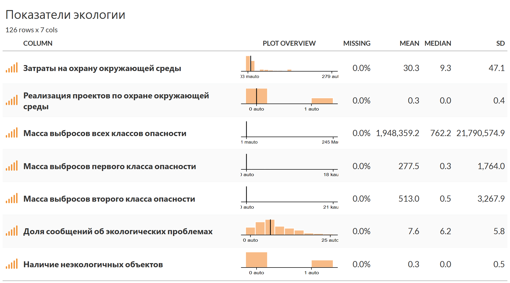

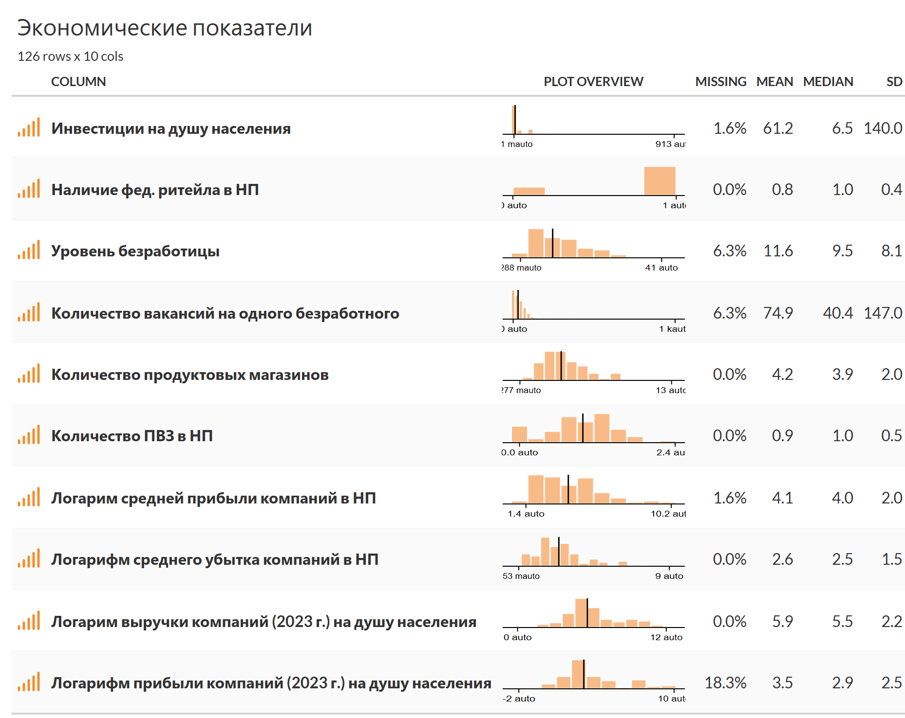

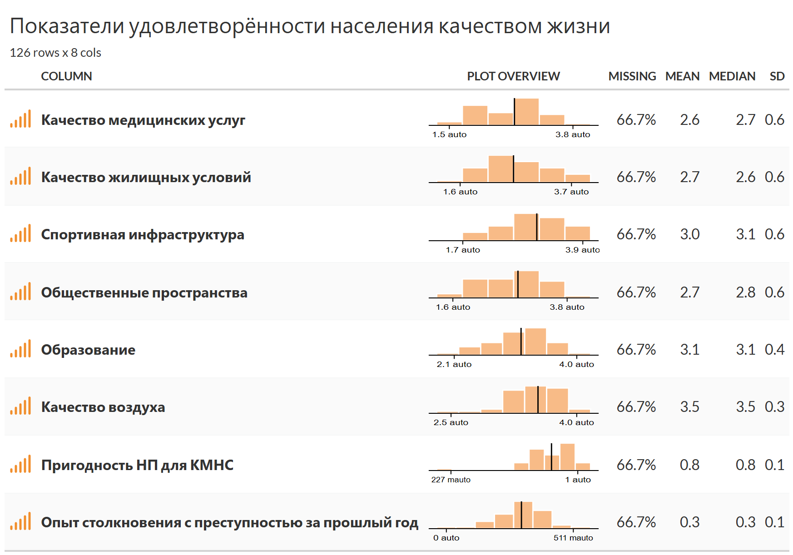

## Миграция 

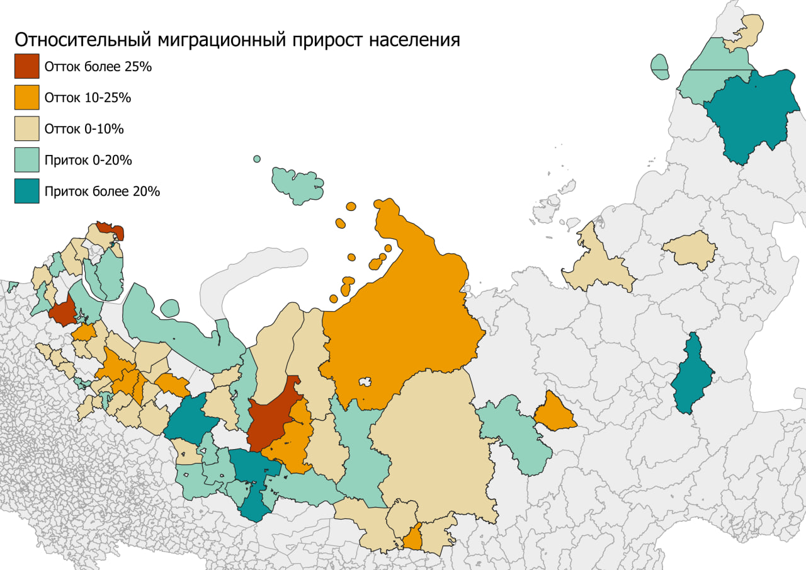
Между регионами Севера можно видеть большую разницу в покрытии дорогами. Наибольшее покрытие дорогами – в европейской части страны, причём как в наиболее северных районах, так и в более южных.
С отдалением на восток уменьшается плотность населения, растёт удалённость населённых пунктов друг от друга, поэтому покрытие дорожной сетью сокращается. 
В регионах Сибири и Дальнего Востока покрытие дорожной сетью наименьшее, из-за низкой плотности населения стоимость строительства дорог в расчёте на население крайне высокое, 
из-за чего инфраструктура концентрируется в больших городах, дороги соединяют крупнейшие населённые пункты и зачастую мало захватывают отдалённые малые города и сельские населённые пункты.
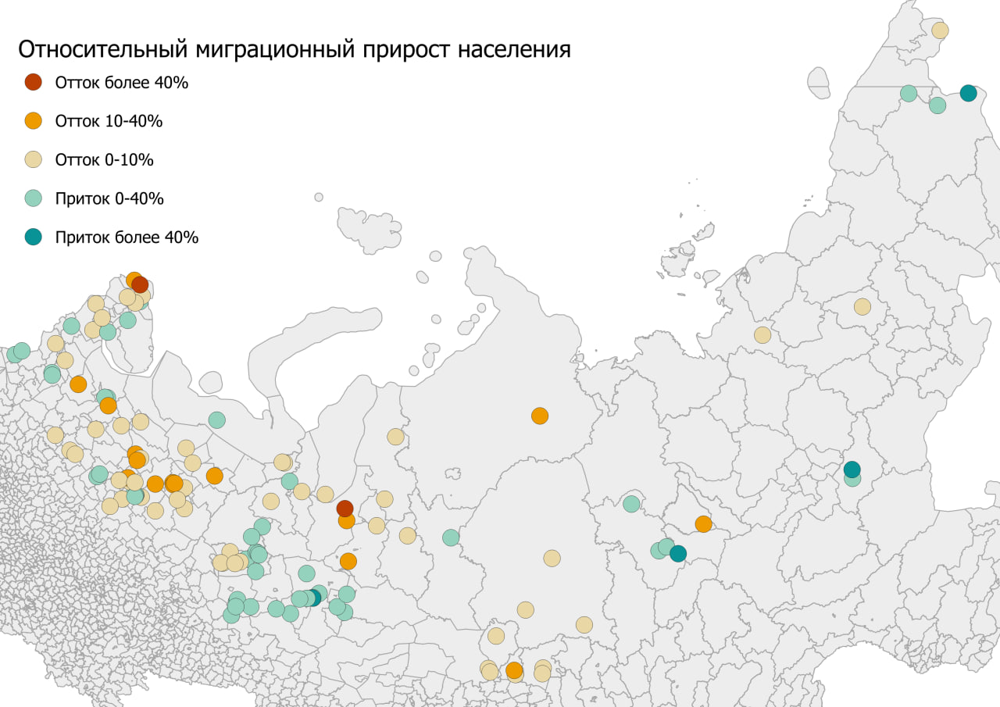

Между регионами Севера можно видеть большую разницу в покрытии дорогами. Наибольшее покрытие дорогами – в европейской части страны, причём как в наиболее северных районах, так и в более южных.
С отдалением на восток уменьшается плотность населения, растёт удалённость населённых пунктов друг от друга, поэтому покрытие дорожной сетью сокращается. 
В регионах Сибири и Дальнего Востока покрытие дорожной сетью наименьшее, из-за низкой плотности населения стоимость строительства дорог в расчёте на население крайне высокое, 
из-за чего инфраструктура концентрируется в больших городах, дороги соединяют крупнейшие населённые пункты и зачастую мало захватывают отдалённые малые города и сельские населённые пункты.
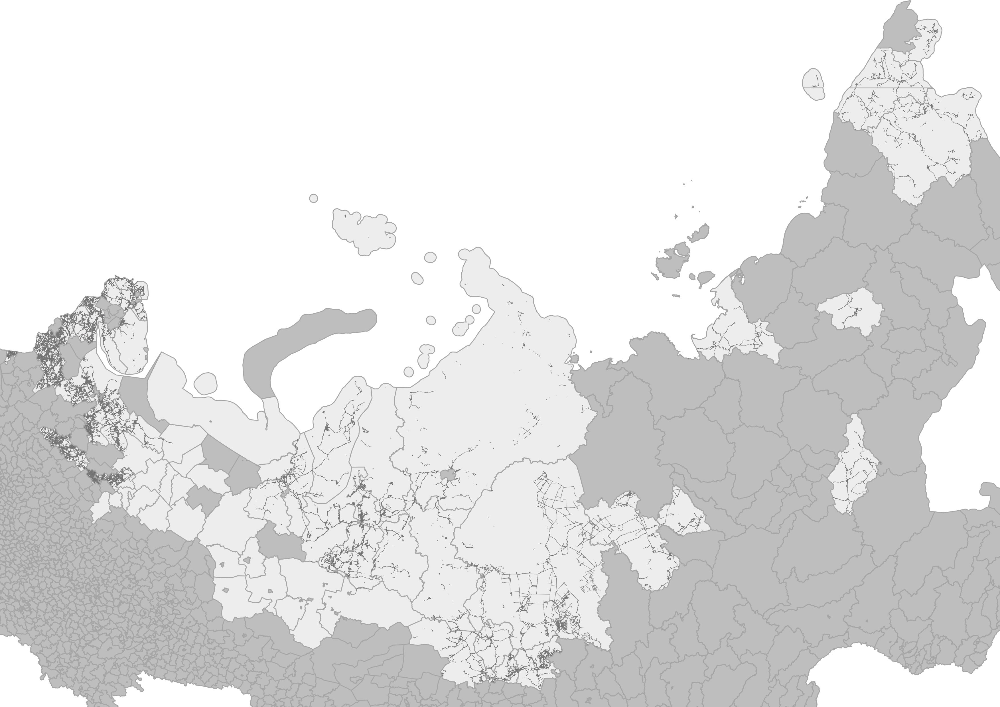

## Кластеризация
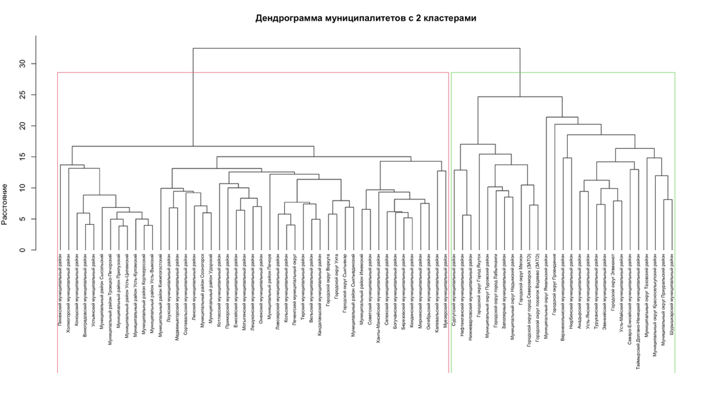

На основе кластерного анализа муниципалитеты разделились на два класса. 
Первый кластер (27 муниципалитетов, 36.5%) преимущественно включает арктические и северные территории с высокой долей коренных малочисленных народов. 
Сюда входят Ямало-Ненецкий автономный округ, Чукотка, Таймыр, Эвенкия, а также районы ХМАО.
Второй кластер (47 муниципалитетов, 63.5%) состоит в основном из более южных и освоенных территорий Европейского Севера, такие как Архангельская область, Карелия, Коми, 
а также некоторые районы Красноярского края.

## Кластеризация муниципалитетов

Для более детального анализа муниципалитеты были разделены на **10 кластеров** на основе визуальной и статистической структуры данных. Это позволило выявить группы территорий с похожими социально-экономическими характеристиками, уровнем инфраструктуры и особенностями географического положения.

### **Кластер 1**
1. Анадырский муниципальный район  
2. Городской округ Эгвекинот  
3. Северо-Енисейский муниципальный район  
4. Таймырский Долгано-Ненецкий муниципальный район  
5. Туруханский муниципальный район  
6. Усть-Майский муниципальный район  
7. Усть-Янский муниципальный район  
8. Эвенкийский муниципальный район  

### **Кластер 2**
1. Березовский муниципальный район  
2. Богучанский муниципальный район  
3. Вельский муниципальный район  
4. Городской округ Воркута  
5. Городской округ Сыктывкар  
6. Городской округ Ухта  
7. Енисейский муниципальный район  
8. Калевальский муниципальный район  
9. Кандалакшский муниципальный район  
10. Кольский муниципальный район  
11. Кондинский муниципальный район  
12. Котласский муниципальный район  
13. Ленский муниципальный район  
14. Лешуконский муниципальный район  
15. Ловозерский муниципальный район  
16. Лоухский муниципальный район  
17. Медвежьегорский муниципальный район  
18. Мирнинский муниципальный район  
19. Мотыгинский муниципальный район  
20. Муезерский муниципальный район  
21. Муниципальный район Ижемский  
22. Муниципальный район Княжпогостский  
23. Муниципальный район Печора  
24. Муниципальный район Сосногорск  
25. Муниципальный район Сыктывдинский  
26. Муниципальный район Удорский  
27. Октябрьский муниципальный район  
28. Онежский муниципальный район  
29. Печенгский муниципальный округ  
30. Приморский муниципальный район  
31. Сегежский муниципальный район  
32. Советский муниципальный район  
33. Сортавальский муниципальный район  
34. Терский муниципальный район  
35. Ханты-Мансийский муниципальный район  

### **Кластер 3**
1. Верхнеколымский муниципальный район  
2. Нюрбинский муниципальный район  

### **Кластер 4**
1. Виноградовский муниципальный район  
2. Коношский муниципальный район  
3. Муниципальный район Корткеросский  
4. Муниципальный район Прилузский  
5. Муниципальный район Сысольский  
6. Муниципальный район Троицко-Печорский  
7. Муниципальный район Усть-Вымский  
8. Муниципальный район Усть-Куломский  
9. Муниципальный район Усть-Цилемский  
10. Пинежский муниципальный район  
11. Устьянский муниципальный район  
12. Холмогорский муниципальный район  

### **Кластер 5**
1. Городской округ город Якутск  

### **Кластер 6**
1. Городской округ Мегион  
2. Городской округ город Лабытнанги  
3. Городской округ город Североморск (ЗАТО)  
4. Городской округ посёлок Видяево (ЗАТО)  
5. Заполярный муниципальный район  
6. Муниципальный округ Надымский район  
7. Муниципальный округ Пуровский район  

### **Кластер 7**
1. Городской округ Провидения  

### **Кластер 8**
1. Муниципальный округ Красноселькупский район  
2. Муниципальный округ Приуральский район  
3. Муниципальный округ Тазовский район  
4. Шурышкарский муниципальный район  

### **Кластер 9**
1. Муниципальный округ Ямальский район  

### **Кластер 10**
1. Нефтеюганский муниципальный район  
2. Нижневартовский муниципальный район  
3. Сургутский муниципальный район  

---

## Выводы по кластеризации

- **Кластер 2** является наиболее представительным и включает **47.3% всех муниципалитетов**. В него вошли территории Европейского Севера с достаточно стабильными социально-экономическими характеристиками.  
- **Кластер 1 (10.8%)** объединяет отдалённые арктические районы с экстремальными условиями проживания.  
- **Кластеры 3, 5, 7 и 9** включают уникальные муниципалитеты:  
  - Якутск — крупнейший столичный центр региона;  
  - Провидения — изолированный арктический порт;  
  - Ямальский район — территория проживания коренных малочисленных народов;  
  - Верхнеколымский и Нюрбинский районы — локальные специфические арктические образования.  
- **Кластеры 6 и 10** объединяют нефтегазовые территории с высокими доходами и инфраструктурой, но разной степенью освоенности.  
- **Кластер 4 (16.2%)** включает сельские районы с традиционной экономикой и относительно низкой плотностью населения.

Такое кластерное деление позволяет выявить ключевые типы арктических муниципалитетов и учитывать их специфику при формировании мер государственной политики и оценке инвестиционного потенциала.

## Сравнение зон
Перейдём к сравнению групп показателей между населёнными пунктами, отнесёнными к Арктической зоне и контрольной группой, чтобы выявить различия между схожими на первый взгляд поселениями.

Согласно данным, в поселениях, находящихся в Арктической зоне, в 2023 году наблюдался отток населения, а также в среднем это более малочисленные населённые пункты относительно контрольной группы. 

С точки зрения экологии населённые пункты Арктической зоны являются более привлекательными в терминах выбросов загрязняющих веществ в атмосферу.

По экономическим показателям также наблюдается примерно равенство двух групп, за исключением показателя инвестиций на душу населения, что может свидетельствовать о том, что программа по увеличению инвестиционной привлекательности этой территории действительно способствует росту инвестиций в регион. Стоит оговориться, что для верификации различий средних показателей между группами недостаточно того, что средние в одной группе больше, чем в другой. Тест на сравнение средних сможет дать более корректный ответ на вопрос, действительно ли они различаются. 

По образованию также наблюдается примерно равная картина по всем показателям.

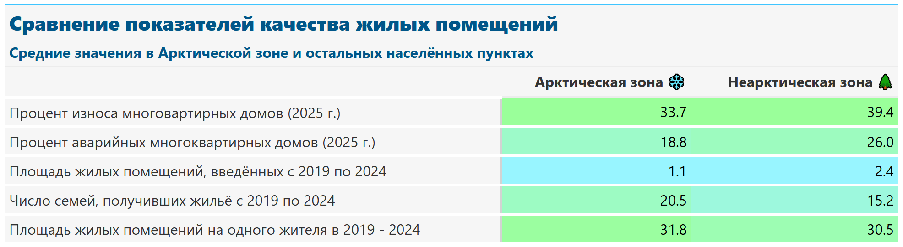
Немаловажным фактором при принятии решения о переезде является качество жилого фонда. Исходя из таблицы выше, можно предположить о том, что качество жилых помещений в населённых пунктах, относящихся к Арктической зоне незначительно выше. 

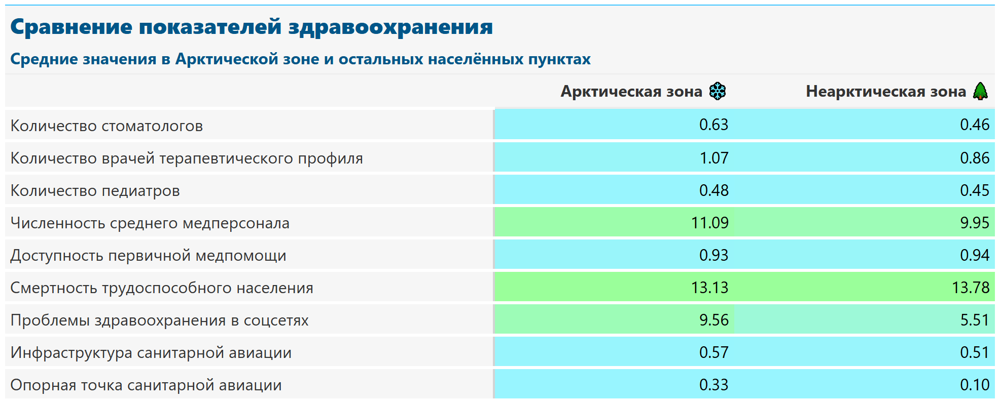
Показатели здравоохранения в выделенных территориях также близки друг другу, как и в других сферах жизни, рассмотренных выше. Выделяется лишь то, насколько чаще жители Арктической зоны поднимает вопрос о проблемах здравоохранения в социальных сетях.

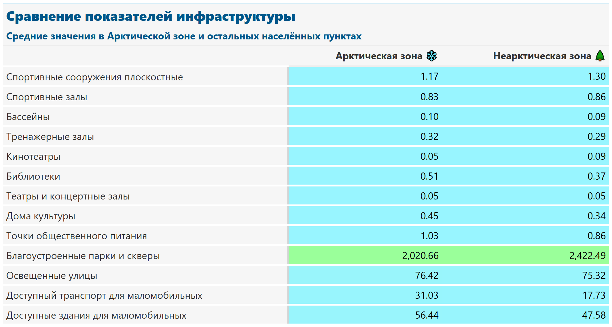
Показатели развития инфраструктуры в обеих зонах также мало отличимы.

Стоит сказать, что в среднем доходы в Арктической зоне выше, причём во всех сферах, которые есть в предложенных данных. Также об этом свидетельствует то, что доля социальных выплат выше в контрольной группе.

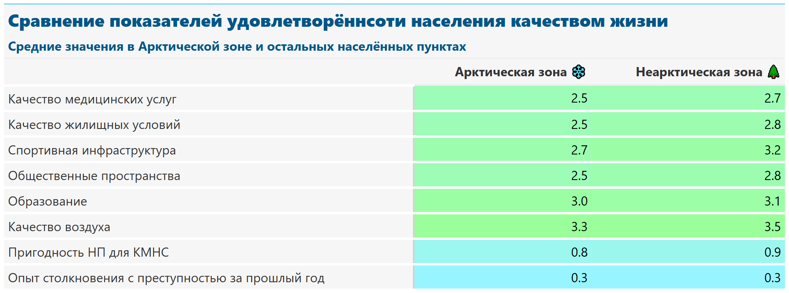
Опросные данные удовлетворённости жизнью лишь подтверждают все предыдущие выводы о том, что выделенные зоны практически не отличаются друг от друга по разным группам показателей.

## Заключение
Подводя итоги проведенного небольшого исследования, можно сделать несколько наблюдений. В первую очередь, стоит отметить, что Арктическая зона на текущий момент демонстрирует определённую привлекательность с точки зрения инвестиционной активности. Это выражается в том, что в ряде показателей, отражающих экономические перспективы региона, Арктика несколько опережает контрольную группу. В частности, инвестиционные потоки, заинтересованность со стороны бизнеса и потенциальные возможности для развития инфраструктуры создают более благоприятные условия для вложений в этот регион.

В то же время, если рассматривать остальные аспекты, включающие демографические показатели, уровень урбанизации, социальные индикаторы и общую экономическую стабильность, значимых различий между Арктической зоной и контрольной группой выявить не удалось. Это позволяет сделать вывод о том, что, несмотря на определённое преимущество в сфере инвестиций, остальные параметры региона находятся примерно на том же уровне, что и у сравниваемых территорий.

Таким образом, можно заключить, что Арктическая зона обладает потенциалом для привлечения инвестиций и представляет интерес для экономических инициатив, однако в целом её социально-экономическое положение пока не выделяется на фоне контрольной группы, и серьёзных отличий в других аспектах наблюдается мало.

